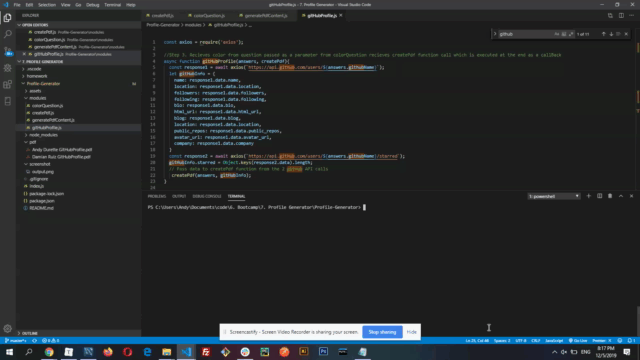

# Profile-Generator
Assignment 7 for University of Toronto coding bootcamp.

This assignment focused on creating a command-line application that dynamically generates a PDF profile from a GitHub username.
